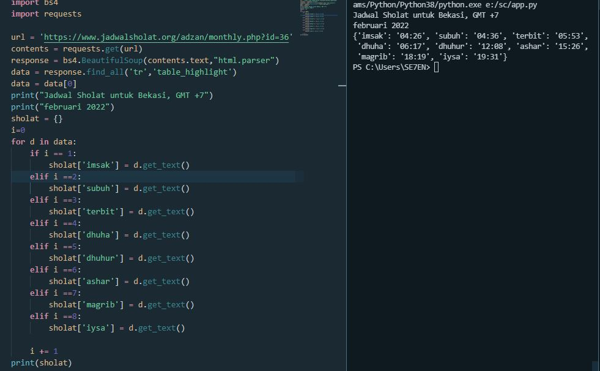

# SCRAPING DATA JADWAL SHOLAT BEKASI FEBRUARI 2022
1. import data data package bs4
2. masukan url website dari jadwal sholat ("'https://www.jadwalsholat.org/adzan/monthly.php?id=36")
3. membuat variabel "sholat" untuk mengeksekusi jadwal
4. for d in data, membuat perulangan menampilkan data jadwal sholat mulai dari imsyak sampai dengan iysa
5. print variabel "sholat"
6. selesai.
